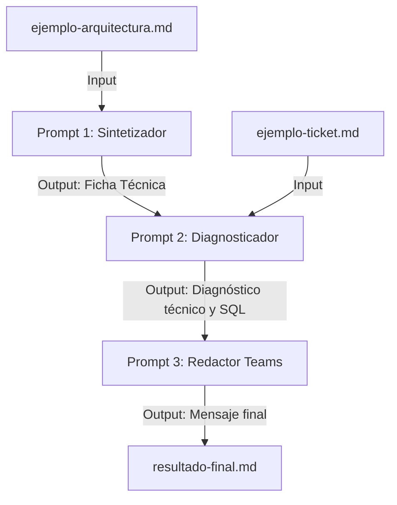

# Proyecto 1: Sistema de Prompts Interconectados (Prompt Chaining Engine) 🤖

Este módulo implementa un motor de automatización para equipos de soporte técnico de primer y segundo nivel utilizando **Gemini 2.5 Flash** de forma local. Resuelve el problema de la pérdida de tiempo analizando incidentes complejos y buscando documentación técnica dispersa, estructurando el diagnóstico y las alertas en segundos.

---

## 🛠️ ¿Cómo funciona el Sistema?

En lugar de usar un único prompt largo (que suele alucinar en tareas complejas), el sistema utiliza una **cadena de 3 prompts interconectados** donde el resultado de una etapa alimenta a la siguiente:



### Detalle de los Prompts:
1.  **[Prompt 1: Sintetizador](prompt1-sintetizar.txt):** Lee la documentación técnica cruda de un sistema (que contiene servidores, puertos, bases de datos y flujos) y genera una **Ficha Técnica de Operación** compacta y estandarizada en Markdown.
2.  **[Prompt 2: Diagnosticador](prompt2-diagnosticar.txt):** Toma la Ficha Técnica de Operación (Paso 1) y el ticket de Jira del cliente. Realiza la clasificación del ticket, detecta componentes afectados y escribe un plan de acción técnico que incluye las queries SQL recomendadas para validar o aplicar el cambio en base de datos.
3.  **[Prompt 3: Redactor Teams](prompt3-redactar.txt):** Toma el diagnóstico (Paso 2) y redacta un **aviso de Teams de una sola pieza**. Este prompt aplica reglas estrictas de confidencialidad (no usar nombres propios) y de formato: traduce las URLs a formato HTML clásico (`<a href="...">`) para evitar que se rompan en los chats de Microsoft Teams, y detecta automáticamente el canal de destino (`SOPORTE Squad` o `SOPORTE Cosmos`) a partir de la clave del proyecto.

---

## 📂 Estructura de Archivos

*   `prompt1-sintetizar.txt`: Plantilla del primer prompt (Sintetizador).
*   `prompt2-diagnosticar.txt`: Plantilla del segundo prompt (DevOps Nivel 3).
*   `prompt3-redactar.txt`: Plantilla del tercer prompt (Redactor Microsoft Teams).
*   `ejemplo-arquitectura.md`: Documento de arquitectura técnica de ejemplo (Input).
*   `ejemplo-ticket.md`: Ticket de Jira de soporte de ejemplo (Input).
*   `run.js`: Script en Node.js que ejecuta de forma secuencial la cadena llamando a la API de Gemini.
*   `resultado-final.md`: Documento consolidado generado automáticamente tras la ejecución.

---

## 🚀 Guía de Ejecución

### Prerrequisitos:
1.  Tener instalado **Node.js v22** o superior.
2.  Contar con una clave de API de Gemini. Puedes obtener una gratuita en [Google AI Studio](https://aistudio.google.com/).
3.  Configurar la variable de entorno `GEMINI_API_KEY` en el archivo `.env` en la raíz del proyecto.

### Ejecutar el motor localmente:
Estando en la raíz del repositorio, ejecuta el siguiente comando:

```bash
node --env-file=.env proyectos/proyecto1-prompts/run.js
```

Esto generará el archivo `resultado-final.md` en esta carpeta con la ficha técnica, el plan de acción detallado y el mensaje de alerta formateado para copiar y pegar en Microsoft Teams.
