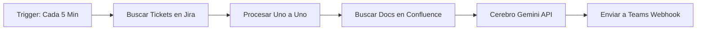

# Proyecto 2: Automatización de Flujo de Soporte (n8n Workflow) ⚡

Este módulo contiene la implementación del flujo de trabajo automatizado y autónomo desarrollado en **n8n** para optimizar la gestión de incidentes en el squad de soporte. Automatiza el proceso de monitoreo de tickets en Jira, búsqueda de documentación en Confluence, análisis inteligente con la API de Gemini y notificación directa en Microsoft Teams.

---

## 🔄 El Flujo de Trabajo Automatizado

El workflow de n8n se ejecuta de manera totalmente autónoma sin requerir intervención humana en ninguno de sus pasos:

### Componentes de la Integración:
1.  **Cada 5 Minutos (Schedule Trigger):** Nodo de inicio que automatiza la revisión periódica de incidentes.
2.  **Buscar Tickets Recientes (HTTP Request - Jira API):** Consulta la API de Jira buscando tickets creados en los últimos 5 minutos de los proyectos asignados (`PEUAS100`, `PESOL120`, `PEDYC600`, `PECMO120`).
3.  **Procesar Uno a Uno (Split In Batches):** Desglosa el arreglo de tickets devuelto por Jira para procesar cada uno de forma individual.
4.  **Buscar Confluence por Proyecto (HTTP Request - Confluence API):** Busca dinámicamente las páginas del espacio de Confluence que correspondan a la clave del proyecto del ticket.
5.  **Cerebro Gemini API (HTTP Request):** Invoca la API oficial de `gemini-2.5-flash` para ejecutar el sistema de prompts encadenados (analizando el ticket contra la arquitectura encontrada).
6.  **Enviar a Teams (HTTP Request):** Realiza una petición POST al webhook de Microsoft Teams para publicar el diagnóstico y el plan de acción directamente en el chat grupal del squad.

---

## 📂 Estructura de Archivos

*   `n8n-workflow.json`: El archivo de exportación del flujo de trabajo en formato JSON, listo para ser importado directamente en cualquier instancia de n8n.

---

## 🚀 Cómo Usar / Importar el Workflow

1.  Asegúrate de tener una instancia de **n8n** corriendo (por ejemplo, localmente mediante Docker usando el archivo `docker-compose.yml` de la raíz del proyecto).
2.  Accede a tu panel de n8n en el navegador (`http://localhost:5678`).
3.  Crea un nuevo workflow vacío.
4.  Haz clic en el menú de opciones arriba a la derecha (icono de tres puntos) y selecciona **Import from file**.
5.  Selecciona el archivo `n8n-workflow.json` de esta carpeta.
6.  **Configura las Credenciales:**
    *   **Jira/Confluence Credentials:** Configura una credencial de tipo *Basic Auth* con tu correo de Atlassian y tu API Token.
    *   **Gemini API Key:** Asegúrate de tener configurada la variable de entorno `GEMINI_API_KEY` en tu contenedor de n8n o reemplaza la variable en la URL del nodo por tu clave de API.
    *   **Microsoft Teams Webhook:** Reemplaza la URL del nodo "Enviar a Teams" con tu webhook real de Teams.
7.  Activa el switch de **Active** arriba a la derecha para que empiece a ejecutarse de forma autónoma.
